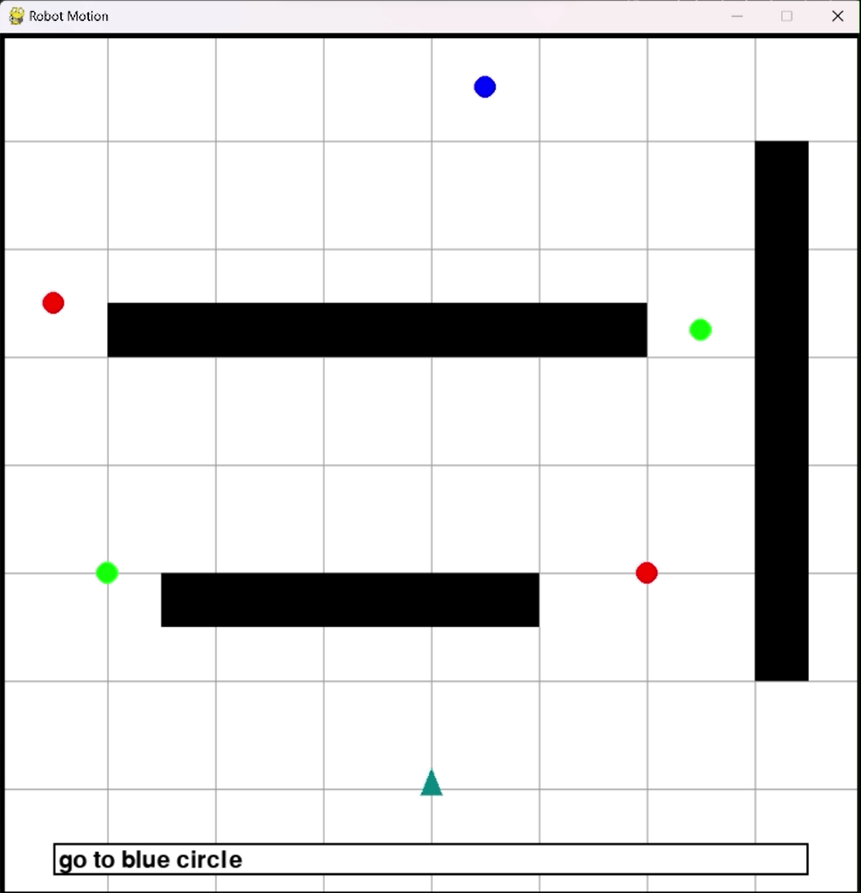

# LLMs for Path Planning Simulation

## Overview
This Python script presents a cutting-edge approach to robotic path planning, where the core innovation lies in its ability to translate high-level, human-like instructions into precise, machine-readable commands for navigation. By leveraging the capabilities of OpenAI's GPT-3.5, a state-of-the-art Large Language Model (LLM), the script bridges the gap between natural language communication and complex robotic control. This integration facilitates dynamic and adaptive path planning in a 2D simulation environment, realized through pygame for visualization and matplotlib for plotting. The script not only simulates path planning using artificial potential fields but also showcases how advanced AI can interpret and execute nuanced human directives in the realm of robotics.

## Features
- Real-time simulation in an 800x800 space with boundaries, using pygame.
- Utilization of artificial potential fields for obstacle avoidance and goal-oriented movement.
- Innovative solution to the local minima problem, enhancing navigational efficiency.
- Direct integration with GPT-3.5 to interpret and process natural language instructions, turning abstract user commands into actionable robotic paths.
- Visual representation and debugging through matplotlib plotting.

## Artificial Potential Field-Based Path Planning
- **Attractive and Repulsive Potentials:** The robot navigates by balancing forces from attractive potentials (goals) and repulsive potentials (obstacles).
- **Local Minima Problem:** A significant challenge where the robot gets stuck without a direction to move due to equal attractive and repulsive forces.
- **Solution in Code:** When a local minimum is detected, the script temporarily sets a corner of the space as a new goal to move the robot out of the stuck position.

## Integration of Large Language Models (LLMs) in Robotics
- **Natural Language Instruction Processing:** Allows robots to understand and act on complex, human-like instructions.
- **Dynamic and Adaptive Decision Making:** Enhances the robot's ability to make real-time decisions based on its current state and environment.
- **Improving Human-Robot Interaction:** Makes interactions with robots more intuitive and efficient, enhancing the overall user experience.

## Role of GPT-3.5 in Path Planning
- **Interpreting User Input:** GPT-3.5 processes high-level, natural language instructions from users.
- **Translating to Actionable Commands:** It translates these instructions into a specific format for the robot's navigation system.
- **Determining Goals and Repulsors:** Based on user input, GPT-3.5 decides the robot's goal location and identifies regions to avoid, configuring them as repulsors in the simulation.
- **Output Format:** The output is formatted to be directly usable by the path planning system, typically including goal coordinates and repulsors.
- **Dynamic Adaptability:** GPT-3.5's ability to adapt to varied instructions makes the robot's path planning flexible and responsive.

## Customization
- Modify the `circle_positions`, `obstacle_positions`, and `start` variables to change the initial setup.
- Update `goal_position` and `repulsors` for different path planning scenarios.

## Future Works and Improvements

### Multiple Coordinating Robots in Formation
- **Formation Control:** Extend to handle multiple robots moving in formation.
- **Collision Avoidance:** Implement inter-robot collision avoidance mechanisms.

### Advanced Path Planning Algorithms
- **Handling General Commands:** Upgrade to process more complex commands.
- **Algorithm Diversity:** Explore different algorithms for various navigation scenarios.

### Robustness Framework
- **Definition and Measurement:** Develop a framework for defining and measuring robustness.
- **Enhanced Adaptability:** Improve adaptability to changing environments and scenarios.

### Enhanced LLM Integration
- **Improved Natural Language Understanding:** Further enhance LLM integration for nuanced instructions.
- **Feedback Loop:** Establish a feedback loop for continuous improvement.

### User Interface and Experience
- **Intuitive UI:** Develop a user-friendly interface for inputting commands and visualizing paths.
- **Real-World Testing:** Test in real-world scenarios for practical insights and refinements.

## Simulation Screenshot

Below is a screenshot of the simulation in action, demonstrating the user interface with a command input to "go to blue circle" and the resulting visualization of the robot's path planning towards the blue circle while avoiding obstacles.

